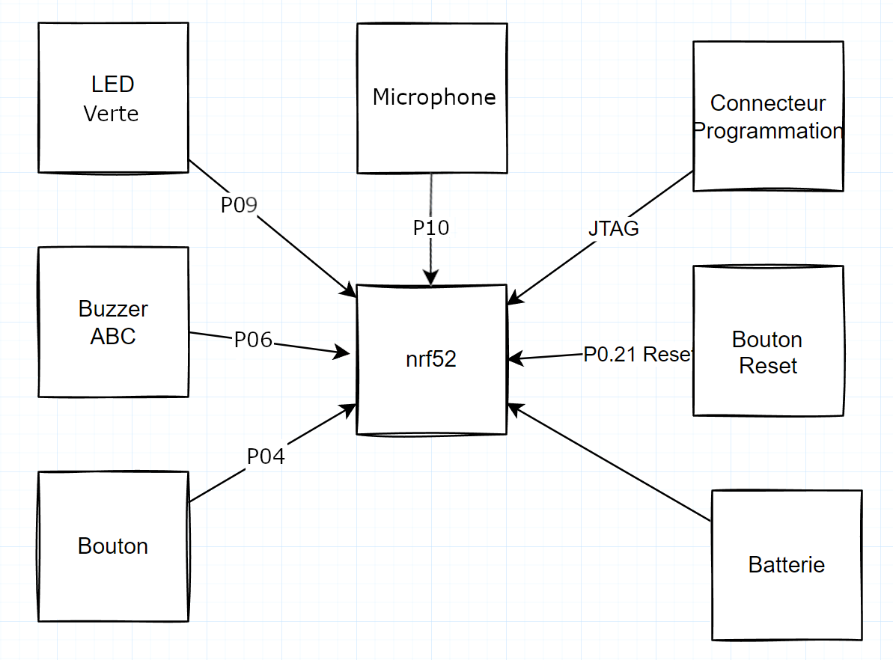

# Key-Finder design

Ce repository représente le travail de Laurencot Mathieu pour les cinquième, sixième et septième séances du cours "Design à deux balles" animé par M. Marchand et M. Petit.

L'objectif de ce cours était de concevoir un objet concurrent du [mini traceur gps de action](https://www.action.com/fr-fr/p/2579654/mini-traceur-gps/). Pour ce faire, nous avons travaillé sur la carte électronique qui pourrait être intégrée dans le Key-Finder, ainsi que sur le design de l'objet.

Vous trouverez tous les fichiers de mon travail dans ce repository.

## Information

Le travail a été réalisé en utilisant les logiciels KiCad 7.0 et Fusion 360. Il vous suffit de cloner le projet, puis de l'ouvrir avec le logiciel KiCad. Importez ensuite le fichier Design_key_finder.f3z dans l'application Fusion 360.

L'objectif était de partir d'une base du composant nRF52 et d'y ajouter les fonctionnalités que nous avons observées sur le Key-Finder de Action au cours des sessions précédentes.

### Les fonctionnalités standard

La liste des fonctionnalité est disponnible sur le schéma ci-dessous

Pour récapituler le schéma, nous avons ajouté un buzzer relié à la pin 06 de la puce, une LED verte reliée à la pin 09, et un bouton relié à la pin 04. Il y a également le bouton reset, relié à la pin 21 également nommée pin de reset, et une batterie reliée au VCC et à la masse (ground). Enfin, il y a un connecteur de programmation (qui pourrait disparaître dans la version finale) relié aux pins SWDIO, SWDCLK, la pin de reset (inversée) et les pins 22, 23 et 24.

### Le petit plus

De plus, j'ai fait le choix d'ajouter, comme vous pouvez le voir sur le schéma ci-dessus, un microphone relié à la pin 10. C'est une fonctionnalité annoncée sur l'emballage du Key-Finder de Action mais qui n'est pas présente sur la carte électronique, et qui n'existe donc pas. J'ai donc décidé d'ajouter un microphone qui pourrait assez facilement avoir les fonctions suivantes:

- Sonner à une commande vocale précise (pour éviter à l'utilisateur de devoir chercher son téléphone pour ensuite chercher ses clés).
- Pouvoir configurer la commande vocale nécessaire pour sonner (pour éviter d'utiliser un mot anglais assez rare en France, donc qui n'active jamais le Key-Finder sans raison, mais qui, si l'on part en voyage à l'étranger, se retrouve à s'activer fréquemment sans raison).
- Utiliser une commande vocale pour envoyer une commande au téléphone, par exemple, déclencher la prise d'une photo.

### Le designe

Étant donné que c'est mon premier projet sur Fusion, vous remarquerez que les formes sont assez basiques, mais néanmoins efficaces. Le design suit le modèle du Key-Finder de Action, donc on retrouve une boucle pratique pour attacher le Key-Finder à un porte-clés, par exemple, un bouton pour allumer et éteindre l'objet, ou encore pour demander à l'objet d'envoyer un signal au téléphone. Il y a aussi un capuchon qui protège la pile (facilement amovible, ce qui permet de changer la pile au besoin) et enfin un trou traversant en face de la LED pour voir quand la LED s'allume des deux côtés de l'objet.

De plus, contrairement à l'objet d'Action, j'ai choisi d'augmenter la portée du son du buzzer en ne bloquant pas le son. Pour ce faire, j'ai créé quelques ouvertures sur les coques. Un groupe de sorties est situé au-dessus du buzzer, et un groupe est situé en dessous du microphone.
L'inconvénient de ce choix est la perte de la résistance à l'eau, mais étant donné qu'il n'y a aucun joint sur l'objet original et qu'il y a un trou pour la lumière de la LED, je ne pense pas avoir beaucoup détérioré cet aspect.

## Limitation

### Electronique

Au cours de ce travail, je me suis heurté à de nombreux problèmes électroniques, dont certains ne sont actuellement pas résolus, ce qui fait que dans l'état actuel, la carte n'est pas utilisable. On peut notamment citer le fait que la pin reset du JTAG est censée être inversée, mais ne connaissant pas les inverseurs, je n'ai pas pu le faire.
On peut également mentionner les traces lors du tracé qui ont quelques angles un peu aigus, ce qui risquerait de créer des résonances et donc de poser des problèmes avec la norme CE. De plus, l'antenne n'est certainement pas réalisée exactement au centième de millimètre près.
Enfin, certains des composants sont probablement mal câblés en raison de mon manque de connaissance dans ce domaine en particulier.

### Designe

Pour la partie design, pas trop de problème, il faudrait juste, pour améliorer le design, avoir des connaissances en physique supplémentaires pour connaître la taille minimale d'un trou qui peut permettre à l'eau de s'infiltrer ou encore la disposition adéquate pour que des trous laissent passer le son le mieux possible. De plus, il est possible que le design manque de calles en haut et en bas pour bloquer le PCB, mais comme le PCB est censé s'emboîter parfaitement, il ne devrait pas bouger, c'est à mon avis un test à réaliser.

## Conclusion

Ce repository est la conclusion d'un semestre de travail sur un Key-Finder. Ce travail pourrait être amélioré par des connaissances en physique plus approfondies. Ou encore des tests avec des objets physiques, mais le résultat de ce travail est globalement presque réalisable, il ne resterait plus qu'à y intégrer le code.

